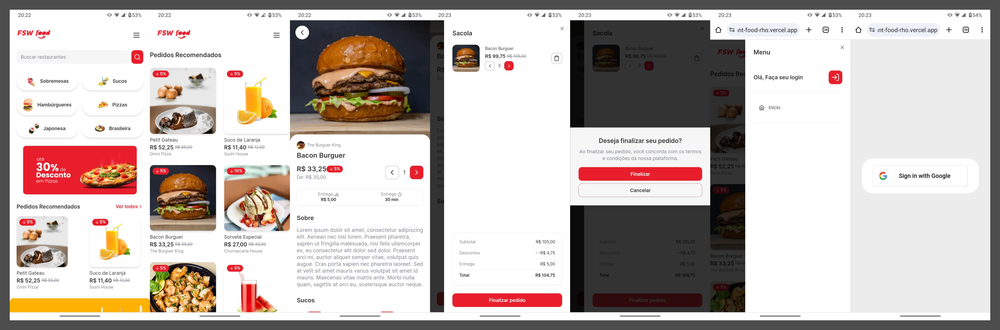

<h1 align="center">
    
    <p>Descrição Curta do Projeto</p>
    Acesse o site: <a href='https://restaurant-food-rho.vercel.app/' target='_blank' >FSW food</a>
</h1>



## Sobre

O **FSW Food** é uma plataforma semelhante ao iFood, que permite aos usuários fazer pedidos de comida de diversos restaurantes, navegar por diferentes categorias de alimentos e aproveitar promoções exclusivas.

## Tecnologias Usadas

- [Next](https://nextjs.org/)
- [Node.js](https://nodejs.org/en)
- [PostgreSQL](https://www.postgresql.org/)
- [Prisma](https://www.prisma.io/)
- [Shadcn](https://ui.shadcn.com/)

## Como Contribuir

```bash 
# Clone o Projeto
$ git clone git@github.com:IanPedroBorges/RestaurantFood.git
$ cd RestaurantFood

# Crie um arquivo chamado docker-compose.yml e cole as informações abaixo
$ touch docker-compose.yml

#docker-compose.yml

version: "3"

services:
  postgres:
    image: postgres:latest
    container_name: fsw-foods-postgres
    environment:
      POSTGRES_USER: postgres
      POSTGRES_PASSWORD: password
    ports:
      - "5432:5432"
    volumes:
      - ./.postgres-data:/var/lib/postgresql/data

volumes:
  .postgres-data:

# Instale as dependências
$ npm install

# Rode o projeto localmente
$ npm run dev
